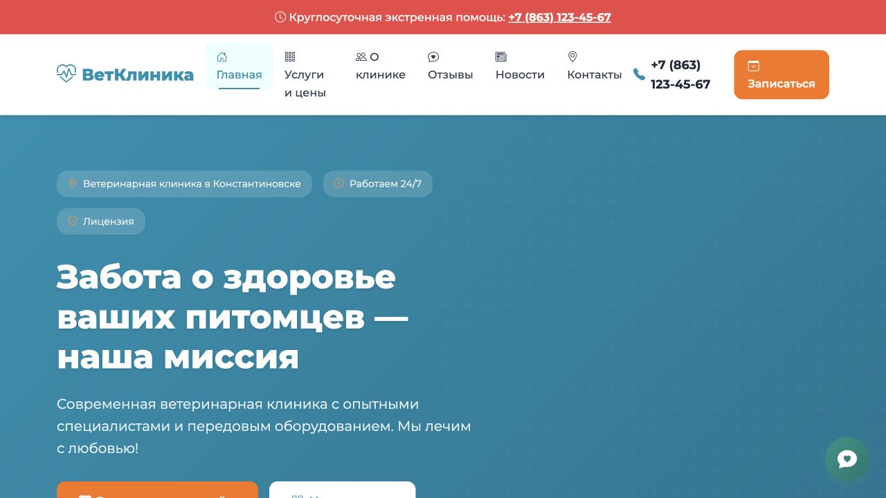

# Сайт ветеринарной клиники

[](https://github.com/Rexarrior/vetirinary/actions/workflows/ci.yml)
[](https://github.com/Rexarrior/vetirinary/actions/workflows/codeql.yml)
[](https://github.com/Rexarrior/vetirinary/actions/workflows/deploy.yml)

Сайт небольшой ветеринарной клиники на Django. Публичная часть показывает услуги,
врачей, новости, отзывы и контакты; контент редактируется через Django Admin. На всех
страницах доступен русскоязычный справочный чат-ассистент на NVIDIA NOOA.



## Возможности

- страницы клиники, услуг и цен, врачей, новостей, отзывов и контактов;
- форма обратной связи и карта;
- управление контентом через Django Admin;
- адаптивная вёрстка на Bootstrap 5;
- публичный чат-ассистент с ограниченными read-only источниками данных;
- PostgreSQL, Gunicorn и Nginx в Docker Compose;
- CI, проверка зависимостей, CodeQL и автоматический production deploy с rollback.

Чат не ставит диагнозы и не назначает лечение. Он не получает инструментов для
создания, изменения или удаления записей в базе данных.

## Быстрый запуск через Docker

Понадобятся Docker и Docker Compose.

```bash
git clone https://github.com/Rexarrior/vetirinary.git
cd vetirinary
cp .env.example .env
docker compose up --build
```

Сайт откроется на <http://127.0.0.1:8021/>, админка — на
<http://127.0.0.1:8021/admin/>. Для остановки выполните `docker compose down`.

Создать администратора в запущенном контейнере:

```bash
docker compose exec web python manage.py createsuperuser
```

API-ключ нужен только для работы чата. Остальной сайт запускается без него.

## Локальная разработка

Требуется Python 3.12. PostgreSQL нужен только при разработке в окружении, близком к
production; по умолчанию проект использует SQLite. Зависимости зафиксированы вместе
с транзитивными пакетами и хешами.

```bash
python3.12 -m venv venv
source venv/bin/activate
python -m pip install --require-hashes -r requirements-dev.txt
cp .env.example .env
python manage.py migrate
python manage.py createsuperuser
python manage.py runserver
```

Для локального SQLite можно не задавать `DB_HOST`. Для PostgreSQL задайте `DB_HOST`,
`DB_NAME`, `DB_USER`, `DB_PASSWORD` и `DB_PORT`.

## Настройки окружения

| Переменная | Назначение | Значение по умолчанию |
|---|---|---|
| `SECRET_KEY` | секрет Django; в production обязателен | небезопасное dev-значение |
| `DEBUG` | режим отладки (`1` или `0`) | `1` |
| `ALLOWED_HOSTS` | разрешённые хосты через запятую | `localhost,127.0.0.1` |
| `DB_HOST` | включает PostgreSQL; без него используется SQLite | пусто |
| `DB_NAME`, `DB_USER`, `DB_PASSWORD`, `DB_PORT` | подключение к PostgreSQL | см. `.env.example` |
| `OPENROUTER_API_KEY` | ключ OpenAI-совместимого LLM-провайдера | пусто |
| `NOOA_CHATBOT_MODEL` | модель в формате NOOA registry | `openai/z-ai/glm-4.5-air:free` |
| `NOOA_CHATBOT_API_BASE` | OpenAI-совместимый API endpoint | OpenRouter API |
| `NOOA_CHATBOT_TIMEOUT_SECONDS` | timeout одного вызова провайдера | `30` |
| `NOOA_CHATBOT_TOTAL_TIMEOUT_SECONDS` | общий бюджет запроса чата | `45` |
| `NOOA_CHATBOT_MAX_CONCURRENT_REQUESTS` | одновременные запросы к агенту на процесс | `2` |
| `CHATBOT_RATE_LIMIT_REQUESTS` | запросы одного клиента за окно | `10` |
| `CHATBOT_RATE_LIMIT_WINDOW_SECONDS` | окно rate limit в секундах | `60` |

Не коммитьте `.env`, API-ключи, пароли и production-дампы.

## Проверки

```bash
ruff check .
ruff format --check .
python manage.py check
python manage.py test
pip-audit --no-deps --disable-pip -r requirements.txt
```

Тесты покрывают публичные страницы, административный доступ, фильтрацию
опубликованного контента, формы и защитные сценарии чат-ассистента. Отдельный тест
перехватывает SQL инструментов ассистента и допускает только `SELECT`.

## Структура

```text
clinic/             настройки и URL Django-проекта
core/               глобальные настройки и главная страница
about/              информация о клинике и врачах
services/           категории услуг и цены
news/               новости
reviews/            отзывы
contacts/           контакты и обращения
chatbot/            публичный NOOA-ассистент
templates/          Django-шаблоны
static/             CSS, JavaScript и изображения
docker/             образы Django и Nginx
.github/workflows/  CI, CodeQL и deployment
```

Подробнее: [архитектура](docs/architecture.md),
[этапы реализации](docs/implementation-stages.md),
[правила участия](CONTRIBUTING.md) и [политика безопасности](SECURITY.md).

## Production

Production-конфигурация находится в `docker-compose.prod.yml`. GitHub Actions
проверяет lint, форматирование, тесты и зависимости, затем разворачивает `main` на
сервере через SSH. Release считается успешным только после readiness-проверок;
неуспешный release автоматически откатывается на предыдущий commit.

## Лицензия

Лицензия проекта пока не выбрана. До появления файла `LICENSE` все права на код
сохраняются за владельцем репозитория.
