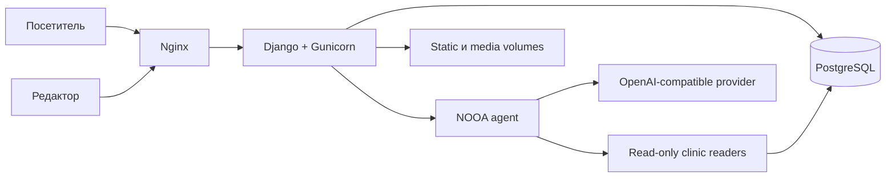

# Архитектура сайта ветеринарной клиники

## Обзор

Проект — монолитное Django-приложение с серверным рендерингом HTML. Публичный сайт,
административная панель и API чат-ассистента работают в одном процессе приложения.
В production перед Django стоят Gunicorn и Nginx, постоянные данные хранятся в
PostgreSQL.

## Django-приложения

| Модуль | Ответственность |
|---|---|
| `clinic` | настройки, корневые URL, health/readiness endpoints |
| `core` | главная страница и общие настройки сайта |
| `about` | информация о клинике, преимущества и врачи |
| `services` | категории услуг, цены и публичный каталог |
| `news` | публикации и страницы новостей |
| `reviews` | модерируемые отзывы |
| `contacts` | контакты, карта и обращения посетителей |
| `chatbot` | публичный чат и NOOA orchestration |

Редакторы меняют содержимое через Django Admin. Публичные views показывают только
активные или опубликованные записи, где соответствующая модель поддерживает такой
статус.

## Чат-ассистент

Endpoint `/api/chatbot/chat/` принимает JSON только методом POST и защищён CSRF.
До обращения к LLM применяются лимиты размера сообщения, истории, частоты и
параллелизма. Общий timeout ограничивает стоимость зависшего запроса. Агрегированные
счётчики запросов, исходов и суммарного времени сохраняются в Django cache без IP,
сообщений и других персональных данных.

NOOA сначала формирует структурированный `ChatPlan`, затем выполняет только выбранные
источники и составляет ответ. В агент не передаются ORM-модели или универсальный
Python/SQL executor. Доступны только функции чтения контактов, услуг и публичных
профилей врачей, а также тематически ограниченный web search. Автотест перехватывает
SQL этих функций и допускает только `SELECT`.

История диалога хранится в `sessionStorage` браузера и передаётся на каждый запрос;
сервер не создаёт отдельное хранилище переписки и не логирует сообщения или IP.

## Данные и файлы

- SQLite используется локально, если `DB_HOST` не задан.
- PostgreSQL 15 используется в Docker и CI.
- `media` содержит загруженные изображения и подключается как persistent volume.
- `staticfiles` создаётся `collectstatic` и раздаётся Nginx/WhiteNoise.
- Production rate-limit использует ограниченный file-based Django cache; один web
  container является текущей поддерживаемой топологией.

## Deployment

`docker-compose.prod.yml` запускает PostgreSQL, Django/Gunicorn и Nginx. Readiness
проверяет БД и HTTP endpoint `/ready/`. Workflow deployment собирает новую версию,
ждёт health checks и при неуспехе возвращает предыдущий commit и образы.

CI выполняет Ruff, Django checks, миграции, тесты, dependency audit и Docker build.
CodeQL запускается для `main`, pull requests и по расписанию. Все сторонние GitHub
Actions закреплены на commit SHA, а Dependabot предлагает обновления Python-пакетов
и workflow actions.

## Границы безопасности

- секреты поступают только через environment/GitHub Secrets;
- production требует HTTPS, secure cookies, HSTS и явный `ALLOWED_HOSTS`;
- чат не может изменять базу;
- Nginx ограничивает размер тела и частоту запросов на внешнем периметре, Django
  повторно валидирует chatbot payload;
- сообщения об уязвимостях принимаются по правилам из `SECURITY.md`.
